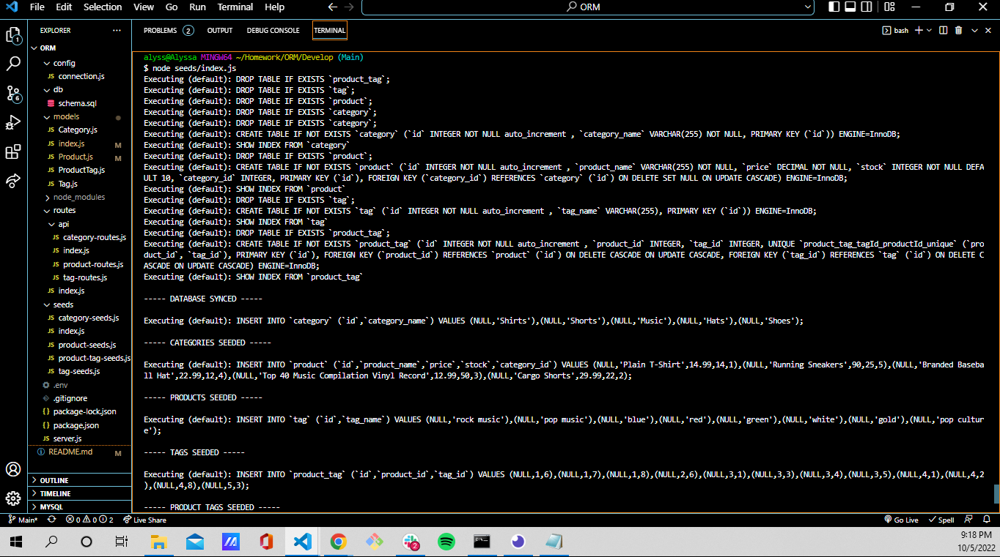
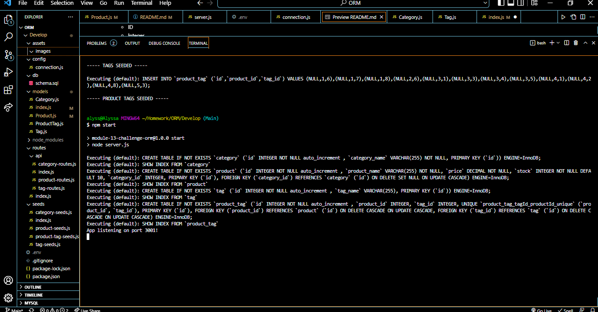

# Object- Relational Mapping(ORM) E-commerce Back End 

## Description 
This is the back end for an e-commerce site. Take a working Express.js API and configure it to use Sequelize to into MySQL database.

### Video walk through:
[Link to video walk through](https://drive.google.com/file/d/1x9NLXFnZO5eVdIvHjCU0d01JOo7mP_zw/view)

### My ScreenShots

This shows the MYSQL tables being started by `node seeds/index.js`

This shows that the nodes has started and is listening on PORT 3001 by starting `npm start`

### User Story
AS A manager at an internet retail company
I WANT a back end for my e-commerce website that uses the latest technologies
SO THAT my company can compete with other e-commerce companies

### Acceptance 
* `GIVEN a functional Express.js API`
* WHEN I add my database name, MySQL username, and MySQL password to an environment variable file
* THEN I am able to connect to a database using Sequelize
* WHEN I enter schema and seed commands
* THEN a development database is created and is seeded with test data
* WHEN I enter the command to invoke the application
* THEN my server is started and the Sequelize models are synced to the MySQL database
* WHEN I open API GET routes in Insomnia for categories, products, or tags
* THEN the data for each of these routes is displayed in a formatted JSON
* WHEN I test API POST, PUT, and DELETE routes in Insomnia
* THEN I am able to successfully create, update, and delete data in my database

## Database Models

* `Category`

    * ID 
    * Integer
    * Doesn't allow null values
    * Set as primary key
    * Uses auto increment
    * `category_name`
    * String
    * Doesn't allow null values

* `Product`

    * ID
    * Integer
    * Doesn't allow null values
    * Set as primary key
    * Uses auto increment
    * `product_name`
    * String
    * Doesn't allow null values
    * `price`
    * Decimal
    * Doesn't allow null values
    * Validates that the value is a decimal
    * `stock`
    * Integer
    * Doesn't allow null values
    * Set a default value of 10
    * Validates that the value is numeric
    * `category_id`
    * Integer
    * References the `category` model's `id`

* `Tag`

    * ID
    * Integer
    * Doesn't allow null values
    * Set as primary key
    * Uses auto increment
    * `tag_name`
    * String

* `ProductTag`
    
    * ID
    * Integer
    * Doesn't allow null values
    * Set as primary key
    * Uses auto increment
    * `product_id`
    * Integer
    * References the `product` model's `id`
    * `tag_id`
    * Integer
    * References the `tag` model's `id`

### Associations
You'll need to execute association methods on your Sequelize models to create the following relationships between them: 

* Product belongs to Category, as a category can have multiple products but a product can only belong to one category.

* Category has many Product models

* Product belongs to many Tag models. Using the ProductTag through model, allow products to have multiple tags and tags to have many products.

* Tag belongs to many Product models. 

### Instructions to run the app
* Getting started
  * npm i mysql2
  * npm i sequelize
  * npm i dotenv

* To store sensitive data place your MYSQL username, password, and database name in .env 

* Use the models template above to set up the models.

* Seed the Database
  * After creating the models, run `npm run seed` to test the routes in CLI.
  * MYSQL tables being started by `node seeds/index.js` in CLI
  * Start node by running `npm start` in CLI

* Log into Insomnia to test your routes for GET, PUT, POST and DELETE.

